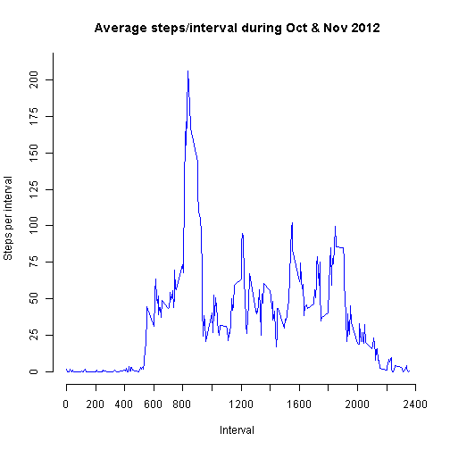

## Loading and preprocessing the data

The variables included in this dataset are:

1. steps: Number of steps taking in a 5-minute interval (missing values are coded as NA)
2. date: The date on which the measurement was taken in YYYY-MM-DD format and stored as date in the dataframe
3. interval: Identifier for the 5-minute interval in which measurement was taken and stored as numeric in the dataframe


## What is mean total number of steps taken per day?

For this part of the assignment, the missing values in the dataset are ignored. However, values recorded as 0 are included for mean and median computation.

#### Make a histogram of the total number of steps taken each day

 

#### Calculate and report the mean and median total number of steps taken per day


- 9354.23 is the Mean of total number of steps taken per day

- 10395 is the Median of total number of steps taken per day

## What is the average daily activity pattern?

#### Time series plot of the 5-minute interval (x-axis) and the average number of steps taken, averaged across all days (y-axis)

 

- 835 is the 5-minute interval, on average across all the days in the dataset, containing the maximum number of steps
- 206.17 is the corresponding number of steps for the above interval

## Imputing missing values

Note that there are a number of days/intervals where there are missing values (coded as NA). The presence of missing days may introduce bias into some calculations or summaries of the data.

#### Calculate and report the total number of missing values in the dataset (i.e. the total number of rows with NAs)
- 2304 

#### Devise a strategy for filling in all of the missing values in the dataset. The strategy does not need to be sophisticated. For example, you could use the mean/median for that day, or the mean for that 5-minute interval, etc. Create a new dataset that is equal to the original dataset but with the missing data filled in.
- The strategy used is copying 5-minute interval average to cells with NA.


```r
DataSetNew <- merge( MeanByInterval, DataSet, by="interval")
for (i in 1:nrow(DataSetNew)) {
	DataSetNew[i,"steps"] <- if (is.na(DataSetNew[i,"steps"])) { DataSetNew[i,"stepsinterval"]} else {DataSetNew[i,"steps"]}
	}
```
#### Make a histogram of the total number of steps taken each day

 

#### Calculate and report the mean and median total number of steps taken per day. 


- 10766.19 is the Mean of total number of steps taken per day

- 9878.53 is the Median of total number of steps taken per day

##### Do these values differ from the estimates from the first part of the assignment? 
- The mean has increased by 15.09 percent
- The median has decreased by 4.97 percent

##### What is the impact of imputing missing data on the estimates of the total daily number of steps?
- The summary statistics shown below indicate a more balanced distribution after imputing


```
##    Min. 1st Qu.  Median    Mean 3rd Qu.    Max. 
##       0    6778   10400    9354   12810   21190
```

```
##     Min.  1st Qu.   Median     Mean  3rd Qu.     Max. 
##    21.87   754.70  9879.00 10770.00 14920.00 52950.00
```

## Are there differences in activity patterns between weekdays and weekends?

 
